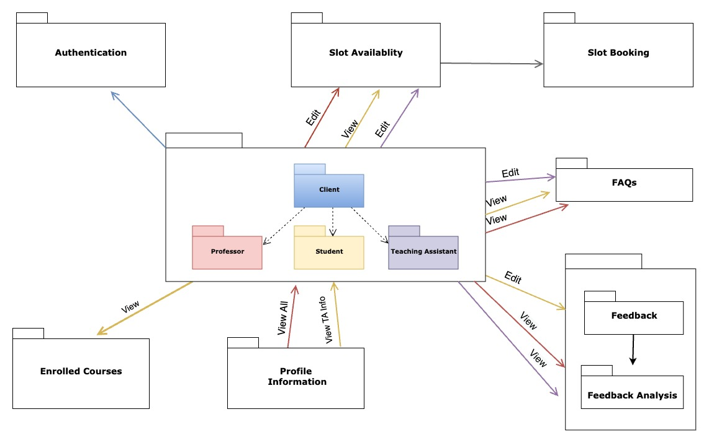
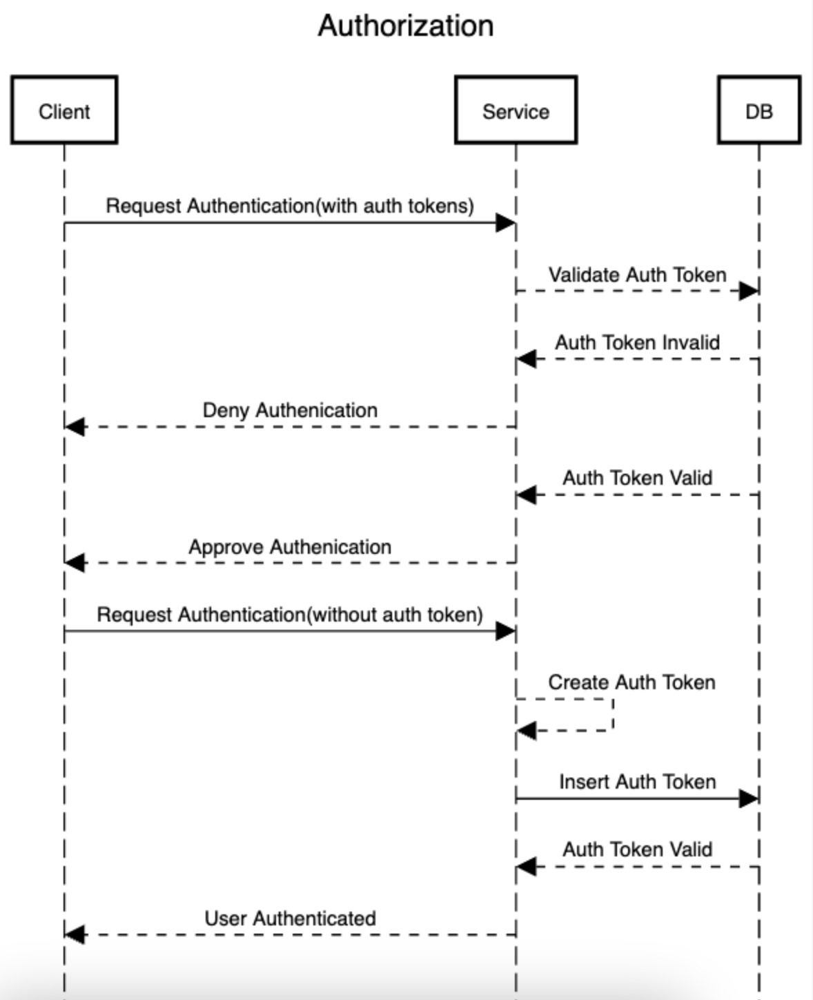

<h1><centre> Project QuickFix</h1></centre>

<h2>🌟 Technologies To Be Used</h2>
<ul>
 <li>Next JS</li>
 <li>ExpressJS and MongoDB with NodeJS for the backend</li>
 <li>Authentication using JWT</li>
 <li>Typescript</li>
 <li>Redis</li>
 <li>Webpack with ESLint, Prettier</li>
 <li>SCSS for styling</li>
</ul>
  

<h2>✅ User Stories</h2>

<h3>Client- Teaching Assistant:</h3>
<ul>
<li>View details of: </li>
<ul>
<li>Course professor</li>
<li>All the students in the course</li>
<li>His overall rating from students, received anonymously</li>
</ul>
<li>Able to enter his basic information which will be visible to all the course students (LinkedIn URL / course-related information)</li>
<li>Able to post the most frequently asked student doubts to save time</li>
<li>Able to post his availability for scheduling the meeting</li>
<li>Will receive emails on meetings being scheduled by students</li>
</ul>
 

<h3>Client- Student:</h3>
<ul>
<li>View details of:</li>
<ul>
<li>Courses the student is enrolled in</li>
<li>List of professor and teaching assistants for each course</li>
<li>Each TA (Their information such as LinkedIn profile and rating)</li>
<li>FAQs related to various assignments and general queries</li>
</ul>
<li>Able to book a slot with TA and receive an email for the scheduled meeting</li>
<li>Able to rate the TAs anonymously</li>
</ul>
 

<h3>Future Scope<h3>

<h3>Client- Professor: </h3>
<ul>
<li>View details of: </li>
<ul>
<li>All students and teaching assistants in the course</li>
<li>Total hours booked by students for each TA for doubt clarification</li>
<li>TA hour utilization in terms of a graph/report (Pie chart)</li>
<li>General FAQs posted by TAs for all the assignments</li>
<li>Ratings given by students to each TA</li>
</ul>
<li>Able to post office hours for students to book slots for doubts</li>
<li>Will receive emails on meetings being scheduled by students</li>
</ul>
  

<h3>Client- Student: </h3>
<ul>
<li>Able to book a slot with Professor and receive an email for the scheduled meeting</li>
</ul>
  

<h2>📊 Domain Model</h2>

   

<h2> Service Models </h2>

 
<h3> Authorization </h3>

   
<h3> Slot Booking </h3>

   
<h2>👥 Authors</h2>
<ul>
<li>Harsh Agarwal - 002750125</li>
<li>Anirban Dutta - 002979520</li>
<li>Shruti Agrawal - 002771205</li>
<li>Payal Khatri - 002775303</li>
</ul>
